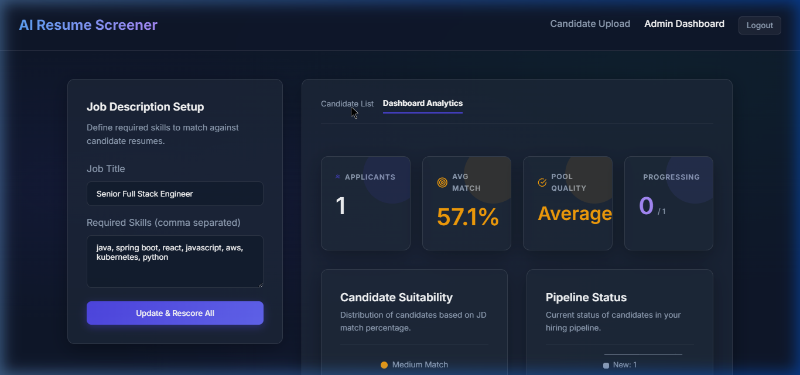
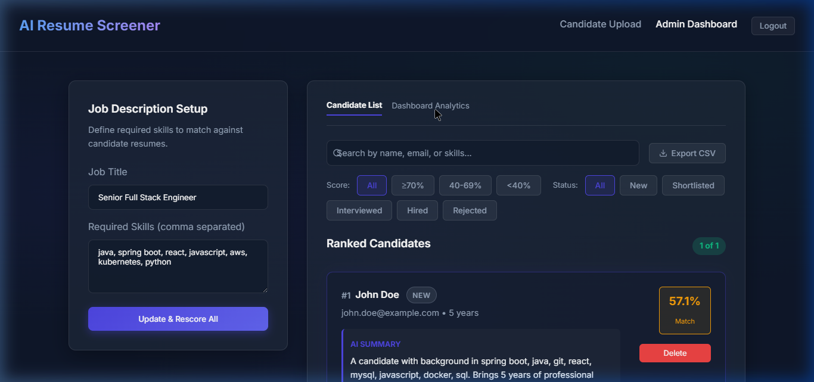
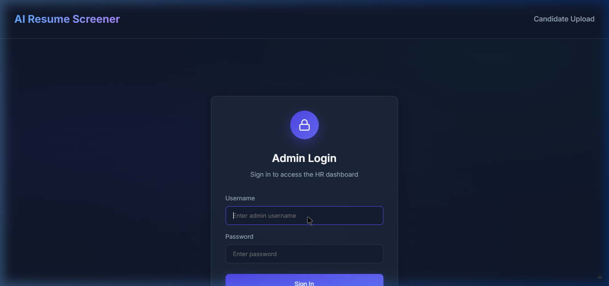
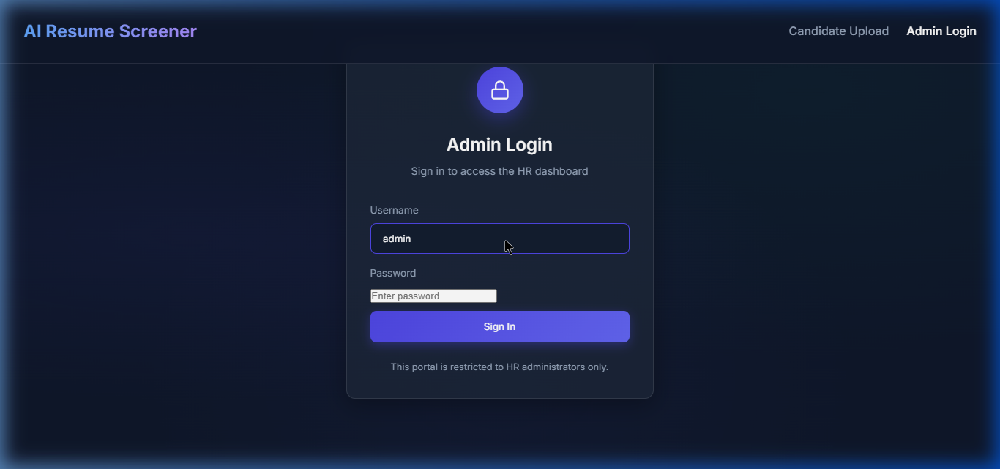

# 🤖 AI-Based Resume Screening System

A full-stack AI-powered Resume Screening System that automates the hiring process for HR teams. Upload resumes, and the system automatically parses, scores, and ranks candidates against job requirements.


---

## ✨ Features

| Feature | Description |
|---------|-------------|
| 📄 **Resume Upload** | Drag-and-drop upload for PDF, DOCX, and TXT files |
| 🧠 **AI Parsing** | Automatically extracts skills, experience, email using NLP |
| 📊 **AI Scoring** | Scores candidates (0–100%) based on skill match with Job Description |
| 🏆 **Smart Ranking** | Candidates ranked from best to worst match |
| 🔍 **Skill Gap Analysis** | Identifies exactly which required skills a candidate is missing |
| 📝 **AI Summary** | Auto-generates a concise candidate profile summary |
| 📧 **Email Notification** | Sends "You are shortlisted" email when score ≥ 60% |
| 📈 **Analytics Dashboard** | KPI cards, pie charts, bar charts for data-driven hiring |
| 🔄 **Status Workflow** | New → Shortlisted → Interviewed → Hired / Rejected |
| 🔐 **Role-Based Access** | Candidates see upload only; Admin sees full dashboard |
| 🔎 **Search & Filter** | Real-time search + score/status filter buttons |
| 📥 **Export CSV** | One-click download of candidate data |

---

## 📸 Screenshots

### Admin Dashboard — Candidate List


### Dashboard Analytics


### Admin Login


### Candidate Upload Page


---

## 🏗️ Tech Stack

- **Frontend:** React.js (Vite), Recharts, Vanilla CSS
- **Backend:** Spring Boot 4, Java 17, Spring Data JPA, Spring Mail
- **Database:** H2 (development) / MySQL (production)
- **Resume Parsing:** Apache PDFBox (PDF), Apache POI (DOCX)

---

## 📂 Project Structure

```
ResumeScreeningSystem/
├── backend/                          # Spring Boot Backend
│   ├── src/main/java/.../
│   │   ├── controller/               # REST API endpoints
│   │   ├── entity/                   # JPA entities
│   │   ├── repository/               # Data repositories
│   │   ├── service/                  # Business logic & AI
│   │   └── config/                   # CORS & web config
│   └── src/main/resources/
│       └── application.properties    # App configuration
│
├── frontend/                         # React Frontend
│   ├── src/
│   │   ├── components/
│   │   │   ├── UploadResume.jsx      # Candidate upload page
│   │   │   ├── AdminDashboard.jsx    # HR dashboard
│   │   │   ├── DashboardCharts.jsx   # Analytics charts
│   │   │   └── AdminLogin.jsx        # Login page
│   │   ├── App.jsx                   # Routing & auth
│   │   └── index.css                 # Design system
│   └── package.json
│
└── Start_ResumeScreener.bat          # One-click startup script
```

---

## 🚀 Getting Started

### Prerequisites
- Java 17+
- Node.js 18+
- Git

### Option 1: One-Click Start
Double-click `Start_ResumeScreener.bat` — it starts both servers and opens the browser automatically.

### Option 2: Manual Start

**Terminal 1 — Backend:**
```bash
cd backend
./mvnw spring-boot:run
```
> Backend runs on **http://localhost:8081**

**Terminal 2 — Frontend:**
```bash
cd frontend
npm install
npm run dev
```
> Frontend runs on **http://localhost:5173**

---


---

## 🧠 How AI Scoring Works

```
Required Skills:  java, spring boot, react, aws, python
Resume Skills:    java, spring boot, react, javascript, docker

Matched: 3/5 → Score: 60%
Gaps: aws, python
Status: Shortlisted ✓
Email: Sent ✉️
```

---

## 📧 Email Configuration

To enable email notifications, update `backend/src/main/resources/application.properties`:

```properties
spring.mail.username=your-email@gmail.com
spring.mail.password=your-app-password
```

> 

---


---

## 🙋‍♂️ Author

Built with ❤️ as a full-stack portfolio project demonstrating AI-powered automation, REST API design, and modern web development.
